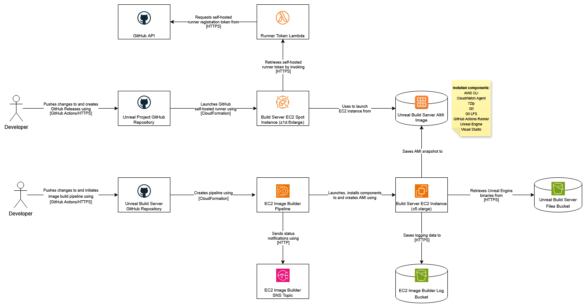

# Unreal Build Server Image

Builds an EC2 Image Builder AMI for an Unreal Engine build server

# Architecture



## Required IAM roles:

- AmazonS3FullAccess
- AWSCloudFormationFullAccess
- AWSLambda_FullAccess

## Required IAM policy:

```
{
    "Version": "2012-10-17",
    "Statement": [
        {
            "Effect": "Allow",
            "Action": [
                "iam:CreateInstanceProfile",
                "iam:DeleteInstanceProfile",
                "iam:CreatePolicy",
                "iam:CreateRole",
                "iam:DeleteRole",
                "iam:DeletePolicy",
                "iam:AttachRolePolicy",
                "iam:DetachRolePolicy",
                "iam:AddRoleToInstanceProfile",
                "iam:RemoveRoleFromInstanceProfile",
                "iam:GetRolePolicy",
                "iam:PutRolePolicy",
                "iam:DeleteRolePolicy",
                "iam:CreateServiceLinkedRole",
                "iam:PassRole",
                "iam:GetRole",
                "iam:TagRole",
                "iam:GetInstanceProfile",
                "imagebuilder:CreateDistributionConfiguration",
                "imagebuilder:CreateComponent",
                "imagebuilder:CreateImagePipeline",
                "imagebuilder:CreateInfrastructureConfiguration",
                "imagebuilder:CreateImageRecipe",
                "imagebuilder:DeleteDistributionConfiguration",
                "imagebuilder:DeleteComponent",
                "imagebuilder:DeleteImagePipeline",
                "imagebuilder:DeleteInfrastructureConfiguration",
                "imagebuilder:DeleteImageRecipe",
                "imagebuilder:GetComponent",
                "imagebuilder:GetImageRecipe",
                "imagebuilder:GetInfrastructureConfiguration",
                "imagebuilder:GetDistributionConfiguration",
                "imagebuilder:UpdateInfrastructureConfiguration",
                "imagebuilder:UpdateDistributionConfiguration",
                "imagebuilder:StartImagePipelineExecution",
                "SNS:Publish",
                "secretsmanager:CreateSecret",
                "secretsmanager:GetSecretValue",
                "secretsManager:DeleteSecret",
                "secretsManager:UpdateSecret"
            ],
            "Resource": "*"
        }
    ]
}
```